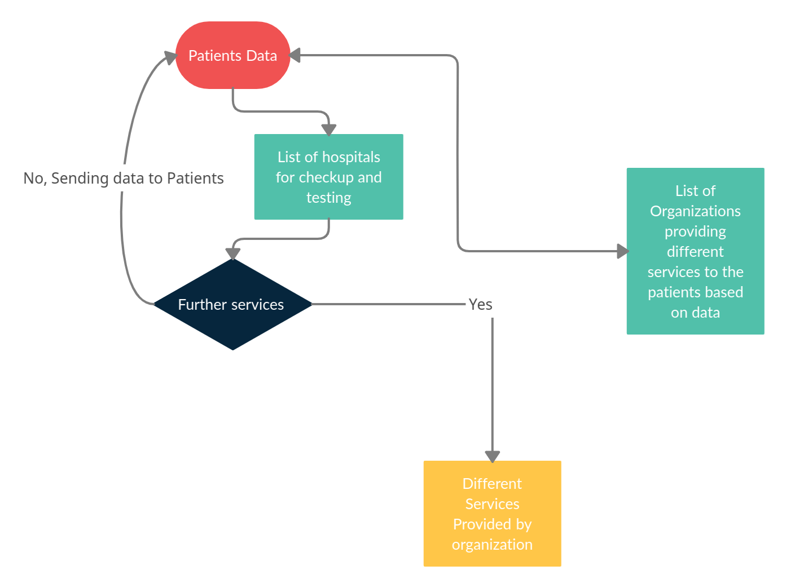

# ICU Patient Care 
This repository contains the code for hackathon

# Summary

This is a simple UI application build with Node Js and python as a backend and integrated with a clustering machine learning model. This application can monitor patients' health by taking data(manual or CSV) and predicting health problems with possible risks factor. We can also use it for finding medicine for basic allergies and the nearest organization selling that medicine from your given location with address. All the models are trained on open-source data.

# Brief
In the healthcare system, patients often must deal with issues of approachability, availability, and affordability when it comes to receiving care at hospitals. In some cases, the patients are required to travel long distances multiple times in a month for treatments and tests. Often these travels get challenging to plan and manage.

My solution is a collaborative way to take care of the patient. The solution is to predict the problems in the early stages and monitor patients' health continuously. Also, reduce the multiple travels and bring the primary care into patients' hands with an application's help.

I am proposing a solution in an application with the help of a machine learning algorithm and an open-source dataset. My solution is divided into three parts-
1- Save the patient's dataset in CSV form and share it with patients. So patients can go to any hospital, which will reduce traffic in hospitals.
2- Analyse the patient's data with my application, and it will give an immediate solution before it leads to a server problem. The patient itself can do it by using its dataset.
3- Provide the nearest organization/medical from the given location to provide the medicine as soon as possible to save time and travel costs.

Application-
I have implemented two basic mapping algorithms and one complex machine learning algorithm. In the mapping algorithm, I have listed different allergies. So if a patient has some basic allergies, he/she can directly use the type of allergy and then find the various medicines available in the market for the given allergy. Also, if the patient will enter his/her location, he/she can find the nearest organization selling the medicine. So with this solution, we can reduce the cost of time and money. The patient can also directly find medicine for an allergy, which can lead to a complex problem if he/she does not find the right medicine at the right time.

Now, if patients have a problem which is at the complicated stage or at the initial stage (like due to low bp, heart rate problem, etc.), so if He/She wishes to check/analyze it so that he/she can contact a doctor if any problems. If the patient goes to hospitals for every analysis, it will be very costly and time-consuming and create massive traffic in hospitals. Also, keeping the data safe of every patient is problematic. Due to these problems, I am storing the data of each patient through time. The patient and the Doctor will have the same data. By doing this, the patient will not be bound to a fixed hospital and can go to any hospital for the medicine or proper care plans after getting the data. Also, I have made an unsupervised clustering machine learning model so a patient/doctor can analyze the basic health if he/she has the data. In this busy time, this app is beneficial for doctors because He/She can quickly analyze the primary or initial stage problem of a patient and look at the analysis in no time and suggest care plans for a patient with my idea app's help.

# Use Case of the Product
Nowadays, ownership of data is crucial, and another important factor is money. During the process of a health checkup to diagnose, patients have to spend lots of money. To reduce the possible cost and time, I'm providing multiple services like, reducing the cost of visiting multiple times, creating self-diagnosis of health with data, self-monitoring, providing the nearest and best organization(hospital) selling the needed medicins, and many more features. 

# Installation Instructions

First you need to install Node.js. If you already have Node.js installed, skip the following commands.

```
curl -o- https://raw.githubusercontent.com/creationix/nvm/v0.33.11/install.sh | bash
source ~/.bashrc
nvm install node
```
Clone the repo
```
git clone https://github.com/RituRajSingh878/Med_Hackathon.git
cd Med_Hackathon
```

Now install the dependencies. Install `pip` first if you don't have it installed by `sudo apt install python-pip`
```
npm install
pip install -r requirements
```

start the application by giving below command in the repository
```
npm start
```

